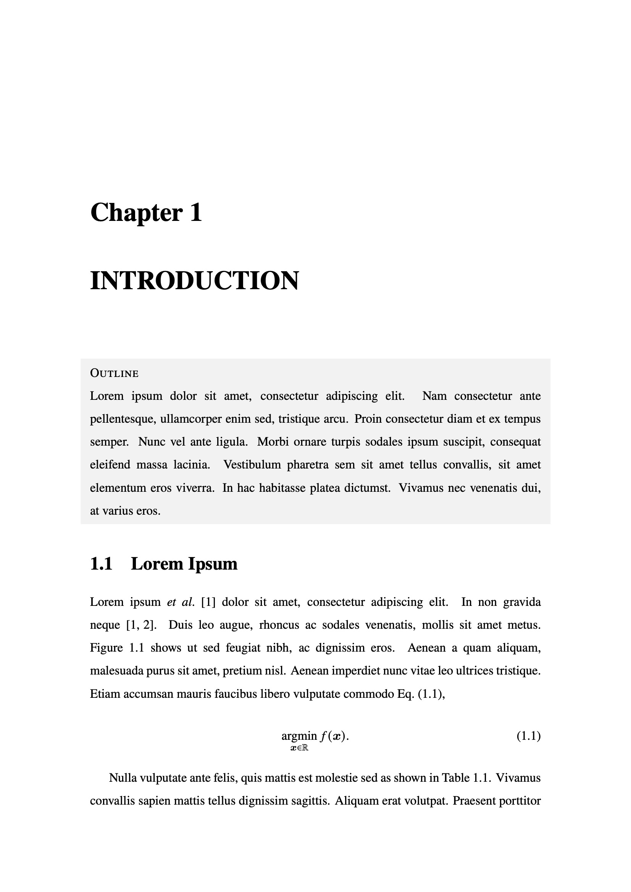
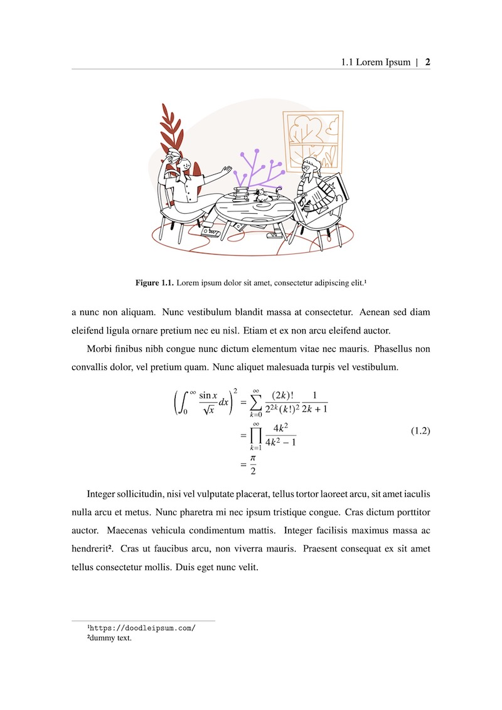

# Minimal LaTeX template

This repository is a LaTeX template for a doctoral thesis, dissertation, and other theses.
It has been designed to be simple and easy to customize so that you can modify it according to the guidelines of each university or institution.

Note: This template assumes the use of **LuaLaTeX**.

---

## Preview
| Chapter title | Chapter content |
|:---:|:---:|
|||


## Test environments
- macOS Monterey (v12.4)
- TeX Live 2022

## Quick start

1. Install TeX Live.

1. Download or `git clone` this repository.

1. Add `Dissertation.cls` to your TeX environment. To create a symbolic link of this class file, use these commands:
    ```
    $ cd /usr/local/texlive/texmf-local/tex/latex
    $ sudo ln -s ~/<this repository>/Dissertation.cls Dissertation.cls
    ```

1. Refresh the TeX databases.
    ```
    $ sudo mktexlsr
    ```
